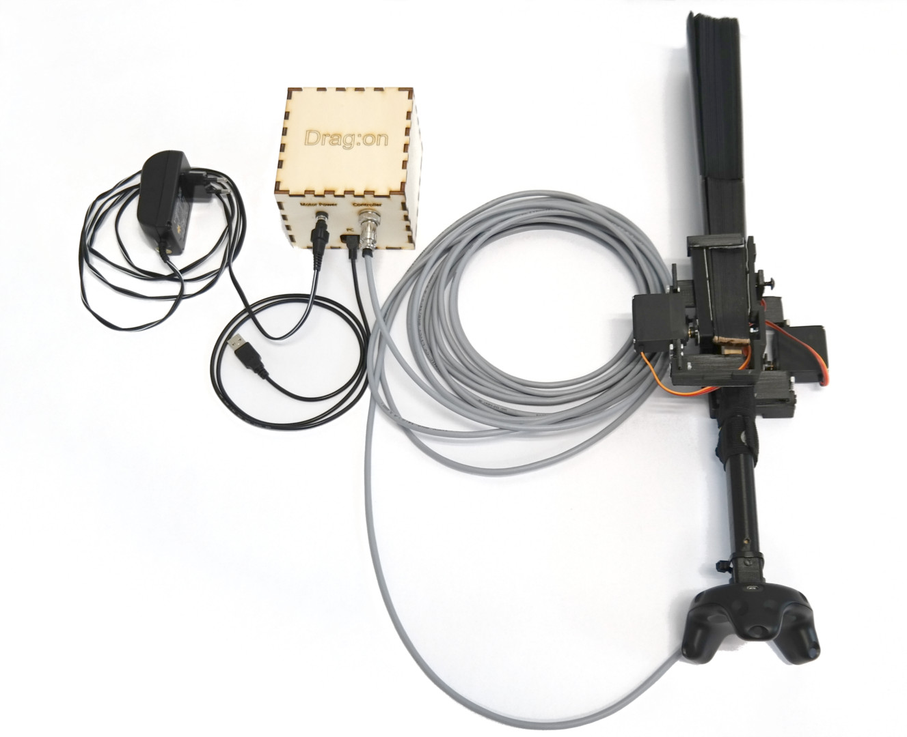
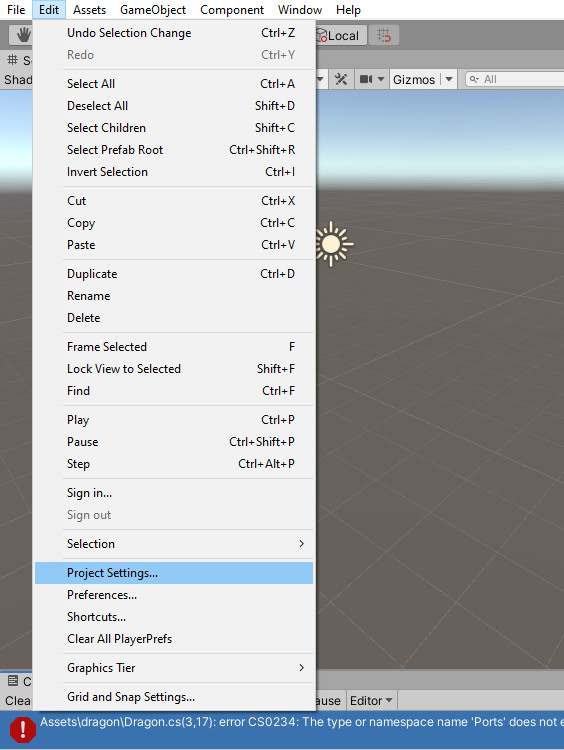

# Drag:on - Build your own haptic VR controller based on air resistance


An assembly kit to build a **Drag:on virtual reality controller with haptic feedback based on air resistance**.  
Below you will find useful links and general instructions, as well as the necessary files, code, and documents.  

Please refer to this repository if you want to re-build Drag:on for private use.
Commercial use of Drag:on and its underlying feedback concept is protected by the following patent:

```
Zenner, A. and Krüger, A. (2021). Hand-Virtual Reality/Augmented Reality-Steuergerät, VirtualReality/Augmented Reality-System mit demselben sowie Verfahren zur Simulation der Haptik.
German Patent 10 2019 105 854. June 05, 2021.
Link: https://register.dpma.de/DPMAregister/pat/PatSchrifteneinsicht?docId=DE102019105854B3&page=1&dpi=300&lang=de&full=true
```

## Paper & Video
The original prototype by [André Zenner (DFKI, Germany)](https://umtl.cs.uni-saarland.de/people/andre-zenner.html) and [Antonio Krüger (DFKI, Germany)](https://umtl.cs.uni-saarland.de/people/prof.-dr.-antonio-kr%C3%BCger.html) is described in detail in the corresponding research article.  
Here you can find the [paper](https://umtl.cs.uni-saarland.de/paper_preprints/zenner-krueger-dragon-chi-19-pre-print.pdf) and [video](https://youtu.be/Wf1Ls4M2afg).

### Reference
Please cite the research article using the reference information below:
```
André Zenner and Antonio Krüger. 2019. 
Drag:on - A Virtual Reality Controller Providing Haptic Feedback Based on Drag and Weight Shift. 
In Proceedings of the 2019 CHI Conference on Human Factors in Computing Systems (CHI ’19). 
Association for Computing Machinery, New York, NY, USA, Paper 211, 1–12. 
DOI:https://doi.org/10.1145/3290605.3300441
```

### BibTeX
If using BibTeX, please use the entry below:
```
@inproceedings{Zenner:2019:Dragon,
author = {Zenner, Andr\'{e} and Kr\"{u}ger, Antonio},
title = {Drag:on -- A Virtual Reality Controller Providing Haptic Feedback Based on Drag and Weight Shift},
year = {2019},
isbn = {9781450359702},
publisher = {Association for Computing Machinery},
address = {New York, NY, USA},
url = {https://doi.org/10.1145/3290605.3300441},
doi = {10.1145/3290605.3300441},
booktitle = {Proceedings of the 2019 CHI Conference on Human Factors in Computing Systems},
pages = {1–12},
numpages = {12},
keywords = {haptic virtual reality controller, shape-changing devices, air resistance feedback, dynamic passive haptic feedback},
location = {Glasgow, Scotland Uk},
series = {CHI ’19}
}
```

## What You Will Need
Apart from the ability to solder basic components and basic DIY skills, you will need access to:
*  soldering equipment
*  a workbench
*  a 3D printer
*  a laser cutter (optional)

## Required Parts
To build a Drag:on, you will need the basic physical parts listed below:

| Amount | Part | Comment |
| ------ | ------ | ------ |
| 1 | 7.5V Power Supply | [Example](https://www.amazon.de/s?k=Universal+Netzteil&__mk_de_DE=%C3%85M%C3%85%C5%BD%C3%95%C3%91&ref=nb_sb_noss_2) |
| > 10m | Cable (8 poles, shielded) | [Example](https://www.reichelt.de/steuerleitung-8x0-14mm-geschirmt-50m-ring-liycy-08-50-p10314.html?&trstct=pos_0&nbc=1) |
| 1 | Plug (8 poles) | must match socket |
| 1 | Socket (8 poles) | [Example](https://www.reichelt.de/mikrofon-kupplung-f-funkgeraete-8-polig-m-608-p11166.html?&trstct=pos_0&nbc=1) |
| 2 | MG996R servo motor with metal gears | [Example](https://www.amazon.de/dp/B07H89JH74/ref=pe_3044161_185740101_TE_item) |
| 1 | Power supply socket | [Example](https://www.ebay.de/itm/5x-Stromversorgungsbuchse-fur-Arduino-5-5-2-1mm-DC022B-Hohlstecker-Einbau/182920397905?hash=item2a96e7c451:g:mpIAAOSwWv5aFqf~) |
| 1 | 1/4 inch screw (camera screw; 12mm x 14mm) | [Example](https://www.amazon.de/dp/B0725VQ2N3/ref=pe_3044161_185740101_TE_item) |
| 1 pack | tesa Powerstrips Large | [Example](https://www.amazon.de/dp/B000KJOC78/ref=pe_3044161_185740101_TE_item) |
| 1 | Arduino Nano | [Example](https://store.arduino.cc/arduino-nano) |
| 1 | Button | [Example](https://www.amazon.de/dp/B07DF5NTZN/ref=pe_3044161_185740101_TE_item) |
| 1 | Vive Tracker | [Example](https://www.vive.com/de/vive-tracker/) |
| 2 | Fans (31 cm) | [Example](https://www.flamenco-kleider.de/product_info.php?info=p173_flamenco-faecher-in-vielen-verschiedenen-farben.html) |
| | 3D printed parts | see [3d-printer](3d-printer) |
| 1 | Drag:on PCB (or Breadboard) | see [circuit](circuit) |
| | basic electronic parts (resistors, capacitors, etc.) | see [circuit](circuit) |
| (1) | box to hold the electronics | see [laser-cutter](laser-cutter) |


## Required Files
Apart from the physical parts, you will need a set of files.  
All these files can be found in this Git repository:
*  3D models (`*.stl` format) to print in folder [`3d-printer`](3d-printer)
*  laser cutter templates (`*.svg` format) to cut in folder [`laser-cutter`](laser-cutter)
*  circuit description (an image) in folder [`circuit`](circuit)
*  source code for the Arduino Nano (the Drag:on firmware) in folder [`dragon-arduino`](dragon-arduino)
*  source code for Unity (the Drag:on `.unitypackage`) in folder [`dragon-unity`](dragon-unity)

## Main Steps
Follow the steps below to build a Drag:on.

### Preparation
1.  Buy all necessary components (see table above)
2.  3D print all required parts (see [video](https://youtu.be/Wf1Ls4M2afg) for part count and [`3d-printer`](3d-printer) for files)
3.  (Laser cut a nice box to hold the electronics - optional - see [`laser-cutter`](laser-cutter) for files and image below for an example)

### Assembly
1.  Assemble the circuit (see image below and [`circuit`](circuit))
2.  Assemble the actual device using the parts you bought and the 3D-printed components. Refer to the [video](https://youtu.be/Wf1Ls4M2afg) and the images on this site to see how it should look at the end. Also, take a look at the [explosion animation](https://youtu.be/Wf1Ls4M2afg?t=117). If you need close-up pictures of any details or parts, please contact [André Zenner](https://umtl.cs.uni-saarland.de/people/andre-zenner.html) (andre.zenner@dfki.de).
3.  Deploy the Arduino source code on the Nano (see [`dragon-arduino`](dragon-arduino))

Drag:on Rendering 1 | Drag:on Rendering 2 | Drag:on Rendering 3
:-------------------------:|:-------------------------:|:-------------------------:
  |   | 

Drag:on Controller Box | Drag:on Circuit | Final Drag:on
:-------------------------:|:-------------------------:|:-------------------------:
 |   | 

### Standalone Test
1.  Connect everything
2.  Test the device itself (standalone mode). For this, start the device by powering it up while holding the button pressed. Now each button press should change the state of the Drag:on and move its two fans.


### Unity Integration
1.  If the standalone test was successful, turn to the Unity Package provided in [`dragon-unity`](dragon-unity).
    1.  Import the package into a new Unity project.
    2.  To use the COM port connection to the Drag:on device, you have to switch to `.NET 4.x` support. For this, go to `Edit -> Project Settings -> Player` and select as `Api Compatibility Level` `.NET 4.x` (instead of `.NET Standard 2.0`; see screenshots below).
    3.  When the initial errors are fixed, have a look at the example scene that integrates the device.
        1.  The scene contains a prefab `Drag:on` that holds a simple 3D model of the device, text indicators to display the current device transformation progress, and most importantly, the `Dragon.cs` and `DragonTest.cs` C# scripts.
        2.  The `Dragon` script implements the interface to send commands to the Drag:on device and read out its internal state. Be sure to **select the correct COM port in the Unity Editor** (see left image below).
        3.  The `DragonTest` script allows to easily trigger the important functions for test purposes via the keyboard. Just hover over "Dragon" to see a tooltip. You can select the desired target fan positions using the sliders `Percent A` and `Percent B` and then press `2` on the keyboard to transform Drag:on into this state (see right image below).
        4.  Please see the comments in the code for additional information.
2.  To integrate the device into a VR application, use a Vive Tracker and the [SteamVR Plugin](https://assetstore.unity.com/packages/tools/integration/steamvr-plugin-32647).
    1.  Screw the Vive Tracker to the Tracker Module at the end of the device grip.
    2.  Calibrate the tracking in the scene so that the real and virtual Drag:on are aligned.


Initial Errors | Select `Project Settings` | Switch `API Compaltibility Level`
:-------------------------:|:-------------------------:|:-------------------------:
 |   | 

`Dragon.cs` script | `DragonTest.cs` script
:-------------------------:|:-------------------------:
 | 

## Contact
For any questions contact [André Zenner](https://umtl.cs.uni-saarland.de/people/andre-zenner.html) (andre.zenner@dfki.de).

## Attribution
When you use a Drag:on in your project, please acknowledge the original [paper](https://umtl.cs.uni-saarland.de/paper_preprints/zenner-krueger-dragon-chi-19-pre-print.pdf) and the resources provided by the authors to build the device in your official documents, published papers, videos, or websites (by citing the paper using the reference above and acknowledging the support).  
**Please also inform [André Zenner](https://umtl.cs.uni-saarland.de/people/andre-zenner.html) (andre.zenner@dfki.de) about your project - we love to hear about it and see what you'll use the Drag:on for!**

This work was supported by the [Deutsches Forschungszentrum für Künstliche Intelligenz GmbH](https://www.dfki.de/) (DFKI; German Research Center for Artificial Intelligence) and [Saarland University](https://www.uni-saarland.de/).
<p></p>
<p></p>
